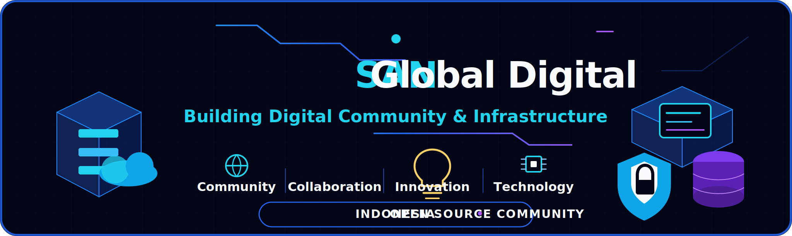

# 🎉 Selamat datang di

  

# 🚀 SansDev Community Organization
[Join Community](https://san-global-digital.vercel.app/)

We are a digital team focused on building creative, modern, and powerful web experiences.

<table>
<tr>
<td align="center" width="33%">
  <h3>🎨 Design</h3>
  
Modern UI, branding, visual identity, and digital creativity.

</td>
<td align="center" width="33%">
  <h3>💻 Development</h3>
  
Web apps, landing pages, portfolio websites, and company profiles.

</td>
<td align="center" width="33%">
  <h3>⚙️ DevOps</h3>
  
Deployment, automation, server setup, and project maintenance.

</td>
</tr>
</table>

 

.png)

SansDev adalah organisasi yang bergerak di bidang edukasi dan bersifat sumber terbuka (open source).
di sini Kami menyediakan Fasilitas Magang dan juga kerja bagi yang ingin mencari pengalaman di bidang:
1. Design
2. Web Development
3. DevOps Enginner
4. Bisnis Management
5. Akuntansi

Dalam bentuk Agency

Dengan Komunitas San Digital Agency yang dikelola dan berada Komunitas Sunset Brew
(San di ambil dari kata Sunset dalam Bahasa Inggris)

Yang artinya Matahari Terbenam rencana Akan di buat Coffee Shop
dengn nama (Sunset Brew)

Pada bulan Oktober 2026 ia merubah nama nya menjadi Sunrise Brew yang artinya terbit  
(Yang berarti membangun dan berkembang)  

Tidak hanya itu, Kami juga menyediakan fasilitas Course, Bootcamp, Sekolah, University, hingga Startup
